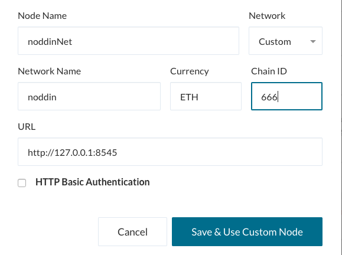
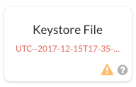
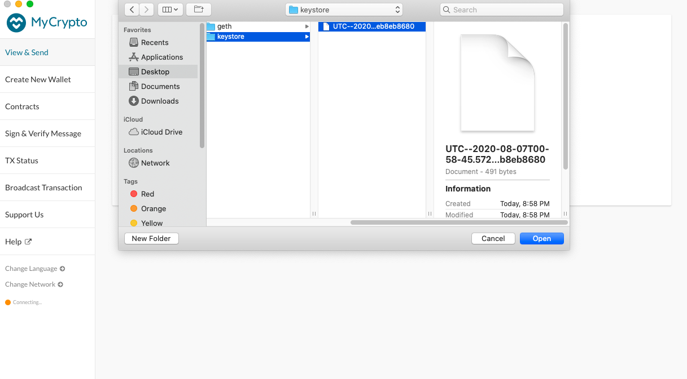
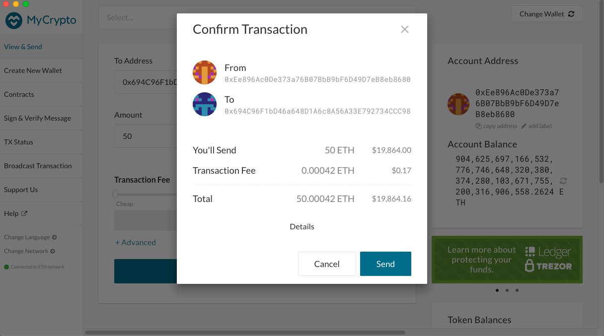
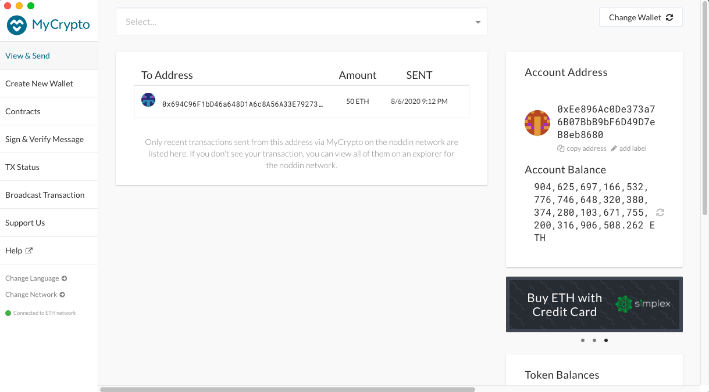

# Creating a Private Blockchain 

# Installs: 
1. MyCrypto 
1. Go Ethereum Tools (latest Geth and Tools) 
    1. create folder to put the tools in that you will simultaneously be using to build and store your blockchain 
    1. Geth = Command line interface to run Ethereum nodes 

# Create Nodes: 
1. Navigate to folder created including Go Ethereum Tools 
1. Create 2+ node accounts using geth with datadir
  1. [./geth new account --datadir NODE_NAMEn]
      1. --datadir = data directory: understands and manages the files
      1. creating a new account in Go Ethereum format, uses the data directory to properly form and store the node created
    1. n = amount of nodes used in the blockchain (at least two for functionality)
1. Run commands for however many nodes you want to use for the blockchain
1. Set passwords for the individual nodes with the prompt (used later to pull keystore file into MyCrypto)

# Create Genesis Block Using ./puppeth
1. Run [./puppeth] 
    1. Tool from geth to ease the functionality of blockchain creation and use 
    1. Guides user through the process rather than having them do everything on their own 
1. Name the network 
1. Follow the prompts 
    1. Configure new genesis - creates first block in the blockchain 
    1. Create new genesis from scratch 
    1. Clique (Proof of Authority) - Regulated by validating nodes, people putting their reputation on the line 
    1.  How many seconds should blocks take? (Default = 15)
      1. Leave at default to alleviate issues with PoA consensus 
    1. Accounts to seal 
      1. insert account addresses from the nodes created in step 2 
      1. means they are allowed to create new blocks 
    1. Accounts to prefund 
      1. again, insert account addresses from the nodes created in step 2 
      1. prefunding accounts since there are no mining rewards in POA
    1. Respond [NO] for pre-funding the pre-compiled accounts with wei to keep the genesis cleaner 
    1. Specify chain / network ID
      1. select three digit ID for the blockchain 
      1. chain / network ID = smart contract between nodes in agreement that the block of data is trustworthy 
        1. information within the contract shared between nodes so everyone has the same information 
    1. Manage existing genesis 
    1. Export Genesis configurations
      1. you only need NETWORKNAME.json
      1. harmony file can be deleted 
1. CTRL + C to close

# Run the First Node: 
1. [./geth init FOLDERNAME/NETWORKNAME.JSON --datadir NODE_NAMEn]
    1. init = initialize new genesis block in the node 
    1. datadir = navigating to the node account created previously 
    1. repeat for other nodes created in step 2 
1. [./geth --datadir NODE_NAMEn --mine --miner.threads 1 --port XXXXn ]
    1. datadir = navigating files/data 
    1. mine = enables node to mine data 
    1. miner.threads = number of CPU threads to utilize during mining (more threads = more power) 
    1. port = network listening port (default = 30303) 
1. + Enter 
    1. will start mining 
    1. copy "enode............" to clipboard 

# Run the Second Node: 
1. Open a new terminal window (keep first window open) 
1. Navigate to folder you were working out of previously (the one with geth tools installed, no further in)
1. [./geth --datadir NODE_NAMEn --bootnodes "paste the enode copied above" --port XXXX+1 --rpc]
    - datadir = navigating files/data
    - bootnodes = allows new node to join the network and find other nodes 
        - identified via key (the enode copied from first node) 
    - port = each node must run on a different port 
    - rpc = only needs to be utilized on one node 
        - used for client-server applications, allows the client to communicate with the server 
1. Leave both nodes up and running. 

# Open MyCrypto
1. MyCrypto is an open-source interface for blockchain where users can interact with their funds via private keys and networks. 
1. MyCrypto supports various Ethereum-like blockchain networks with similar structure. Various testnets allow you to test applications without risking real funds. 
1. Being able to utilize your own personal nodes allows you to control the blockchain process maintaining the decentralized nature of Ethereum. 
1. 

### Create Custom Node
1. Click "Change Network" on the bottom of the left hand column. Scroll to bottom of Network list and then click "+Add Custom Node"
1. Name your node and select "Custom" at the bottom of the 'Network' list. 

1. Name your network, select currency, and set 'Chain ID'. 
    1. The network name and Chain ID will be the same information that you set using ./puppeth in terminal
1. URL = http://127.0.0.1:8545
1. 'Save and Use Custom Node'

### Open Wallet Using Keystore File
1. Open wallet using keystore file 
    
    1. Click 'Select Wallet File'
    1. navigate to folder with geth commands, then into appropriate node folder 
    
    1. Enter password you set in terminal when creating the node
1. Enter unopened node's address into the address box you want to send ETH to. 
1. Set transaction amount/fee 
1. Send Transaction 

## Congrats you have created your own private blockchain! 

